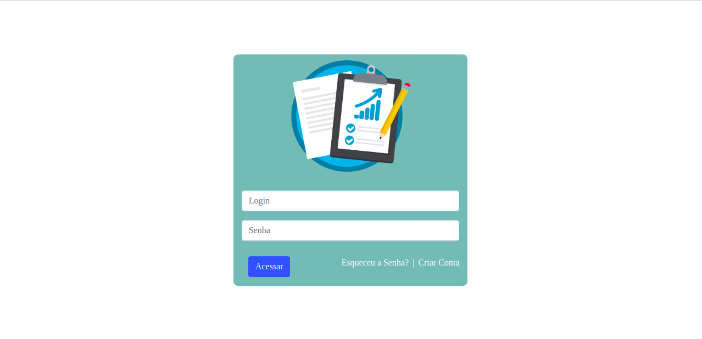
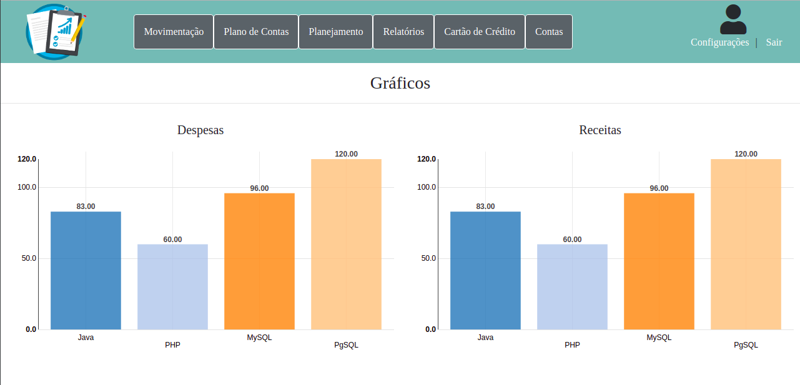
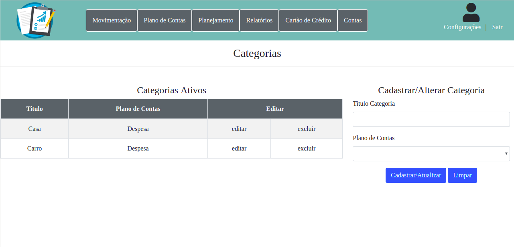
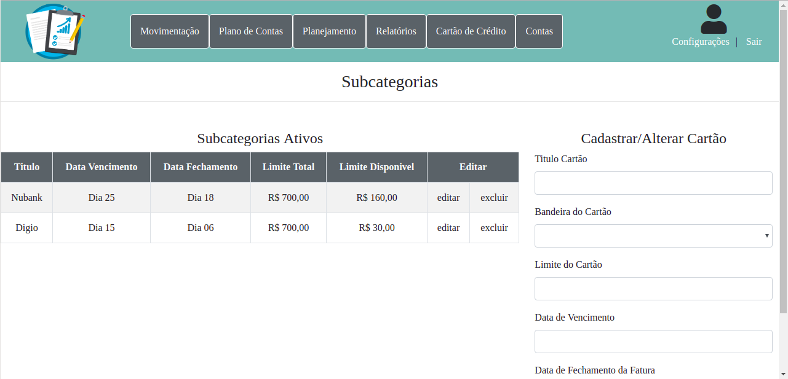

# Controle_Financeiro
### Sobre:
Software para os usuários poderem controlar seus gastos e ter um controle maior da parte financeira.

### Funcionalidades:
#### Movimentação
<ol>
  <li>Cadastro de Despesas</li>
  <li>Listar Despesas</li>
  <li>Cadastro de Receitas</li>
  <li>Listar Receitas</li>
  <li>Controle dos Pagamentos</li>
  <li>Controle dos Recebimentos</li>
  <li>Cadastrar Transação</li>
  <li>Listar Transação</li>
</ol>

##### Plano de Contas
<ol>
  <li>Categorias</li>
  <li>Subcategoria</li>
</ol>

<table>
  <tr>
    <td></td>
    <td></td>
  </tr>
  <tr>
    <td></td>
    <td></td>
  </tr>
</table>
